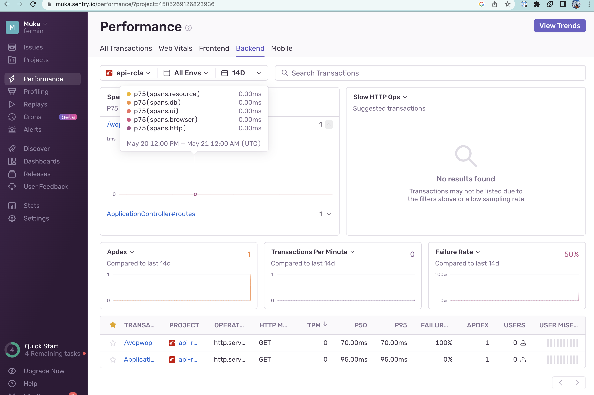

# API-REST

## 🛠️ Environment configuration

### 🔥 Application execution

You could install rails or run through `bin/rails`


Run the development server:

```bash
bin/rails server
```

Open [http://localhost:3000](http://localhost:3000) with your browser to see the result.

You could test the API with [Postman](https://www.postman.com/)
or using curl:
```bash
curl --location 'http://127.0.0.1:3000/routes'
curl --location --request POST 'http://127.0.0.1:3000/route/create?climbing_time=1234&difficult_level=V&comments=wopwop'
```

### Endpoints

- `GET /routes`: Get all routes
- `POST /route/create`: Create a new route
- `GET /ask_tip`: Get a tip form [OpenIA API](https://platform.openai.com/overview)


### 🐳 Docker execution

```bash
docker-compose up --build
docker-compose run web rails db:create db:migrate
```

### ✅ Tests execution

```bash
bundle exec rspec
```

## How to create a new model

```bash
rails generate model RouteModel route_id:string difficult_level:string climbing_time:datetime comments:string0
rails db:migrate
rails db:seed
```

## Events Driven Architecture

I started to use [Event Driven Architecture](https://en.wikipedia.org/wiki/Event-driven_architecture) to decouple use cases and make it more scalable.
I use [Rails Event Store](https://railseventstore.org/) to implement it.

### 📦 Events

- `RouteCreatedEvent`: It is triggered when a new route is created. 


## Observability

Sentry is used to track errors and performance issues.

Dashboard:
https://muka.sentry.io/issues/?project=4505269126823936&referrer=sidebar
