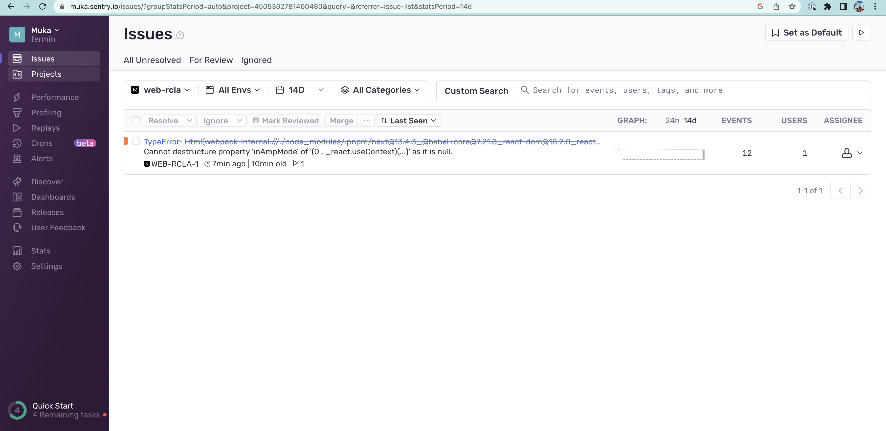

# Web App

## 🛠️ Environment configuration

Install packages:

```bash
pnpm install
```

### 🔥 Application execution

Run the development server:

```bash
pnpm dev
```

Open [http://localhost:3001](http://localhost:3001) with your browser to see the result.

### ✅ Tests execution

```bash
pnpm test
```

## 👀 Monitoring

Sentry: https://muka.sentry.io/issues/?project=4505269126823936&referrer=sidebar


